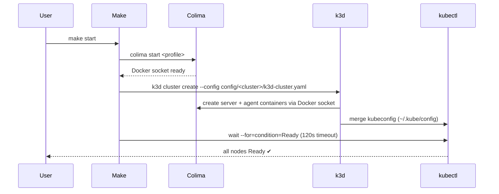

# k8s-colima-cluster

A local Kubernetes development cluster running **1 control-plane node + 2 worker nodes**, powered by [Colima](https://github.com/abiosoft/colima) (Docker runtime) and [k3d](https://k3d.io) (multi-node k3s cluster manager).

```
┌─────────────────────────────────────────────────────┐
│  macOS host                                         │
│                                                     │
│  ┌──────────────────────────────────────────────┐  │
│  │  Colima VM  (Lima + Docker daemon)           │  │
│  │                                              │  │
│  │  ┌────────────────┐  ┌──────────┐ ┌────────┐│  │
│  │  │ k3d-dev-cluster│  │  agent0  │ │ agent1 ││  │
│  │  │  server0       │  │ (worker) │ │(worker)││  │
│  │  │ (control-plane)│  └──────────┘ └────────┘│  │
│  │  └────────────────┘                          │  │
│  └──────────────────────────────────────────────┘  │
│                                                     │
│  kubectl  k3d  helm  (talk to cluster via localhost)│
└─────────────────────────────────────────────────────┘
```

## Prerequisites

- macOS (Intel or Apple Silicon)
- [Homebrew](https://brew.sh)

All other tools are installed by `make setup`.

## Quick start

```bash
# 1. Install tools (once)
make setup

# 2. Start Colima and create the cluster
make start

# 3. Check everything is healthy
make status

# 4. Verify with a test workload
kubectl apply -f manifests/test-app.yaml
kubectl port-forward svc/test-app 8888:80
curl http://localhost:8888          # should return nginx welcome page
kubectl delete -f manifests/test-app.yaml
```

## Make targets

| Target | Description |
|--------|-------------|
| `make setup` | Install prerequisites via Homebrew |
| `make start` | Start Colima + create/resume the cluster |
| `make stop` | Suspend cluster + stop Colima (state preserved) |
| `make delete` | Permanently delete the cluster |
| `make restart` | `stop` then `start` |
| `make reset` | Delete and fully recreate the cluster |
| `make status` | Show Colima, Docker, cluster, and node status |
| `make logs` | Tail k3d node container logs |
| `make kubeconfig` | Print the KUBECONFIG export command |
| `make clean` | Delete cluster + clean generated files |

## Project layout

```
k8s-colima-cluster/
├── Makefile                    # Convenience targets
├── README.md
├── config/
│   ├── dev-cluster/            # Config for the dev-cluster (default)
│   │   ├── colima.yaml         # Colima VM settings (cpu / memory / disk)
│   │   └── k3d-cluster.yaml   # k3d cluster topology (1 server + 2 agents)
│   └── <name>/                 # Add a directory here for each additional cluster
│       ├── colima.yaml
│       └── k3d-cluster.yaml
├── manifests/
│   └── test-app.yaml          # Sample nginx deployment to smoke-test the cluster
└── scripts/
    ├── setup.sh               # Homebrew install of all tools
    ├── start-cluster.sh       # Start Colima → create/resume k3d cluster
    ├── stop-cluster.sh        # Stop/delete cluster + stop Colima
    └── status.sh              # Detailed health report
```

## Configuration

### Colima (`config/<cluster>/colima.yaml`)

Adjust `cpu`, `memory`, and `disk` to match your machine. On **Apple Silicon** uncomment the `vmType: vz` and `rosetta: true` lines for best performance.

### k3d cluster (`config/<cluster>/k3d-cluster.yaml`)

| Setting | Default | Notes |
|---------|---------|-------|
| `servers` | `1` | Control-plane nodes |
| `agents` | `2` | Worker nodes |
| `image` | `rancher/k3s:v1.29.4-k3s1` | Pin to a specific k3s release |
| API server port | `6443` | `localhost:6443` |
| HTTP ingress | `8080→80` | Mapped on all agent nodes |
| HTTPS ingress | `8443→443` | Mapped on all agent nodes |

To change the number of workers, edit `agents:` in `config/<cluster>/k3d-cluster.yaml` and run `make reset`.

## Multiple clusters

Each cluster needs its own subdirectory under `config/`. To add a new cluster:

```bash
# 1. Copy an existing config as a starting point
cp -r config/dev-cluster config/staging

# 2. Edit config/staging/k3d-cluster.yaml
#    - Change name: to staging
#    - Adjust agents, ports, k3s version as needed

# 3. Edit config/staging/colima.yaml
#    - Adjust cpu/memory if this cluster needs different resources

# 4. Start it with CLUSTER=staging
CLUSTER=staging make start

# 5. Stop it
CLUSTER=staging make stop
```

Multiple clusters can run simultaneously as long as their port mappings don't clash. The default `dev-cluster` uses ports `6443`, `8080`, `8443` — use different ports in additional cluster configs.

### Environment variable overrides

```bash
CLUSTER=staging make start
```

| Variable | Default | Description |
|----------|---------|-------------|
| `COLIMA_PROFILE` | `k8s` | Colima profile name |
| `CLUSTER_NAME` | `dev-cluster` | k3d cluster name |

## How it works

1. **Colima** starts a lightweight Linux VM using Lima and exposes a Docker-compatible socket at `~/.colima/<profile>/docker.sock`.
2. **k3d** connects to that socket and launches Docker containers that act as Kubernetes nodes (one server / control-plane, two agents / workers) using k3s as the Kubernetes distribution.
3. **kubectl** talks to the API server exposed on `localhost:6443`, using a context automatically merged into `~/.kube/config`.

### Cluster startup sequence



## Troubleshooting

**Cluster won't start / times out**
- Run `make status` and check if Colima is running.
- Increase `timeout` in `config/k3d-cluster.yaml`.
- Try `make reset` to start fresh.

**Cannot reach the API server**
- Ensure port 6443 is not already in use: `lsof -i :6443`.

**Docker: permission denied / daemon not found**
- Make sure the Colima profile is running: `colima status --profile k8s`.
- Re-export the socket: `export DOCKER_HOST=unix://$HOME/.colima/k8s/docker.sock`.

**Apple Silicon – slow image pulls**
- Uncomment `vmType: vz` and `rosetta: true` in `config/colima.yaml` and recreate with `make reset`.
